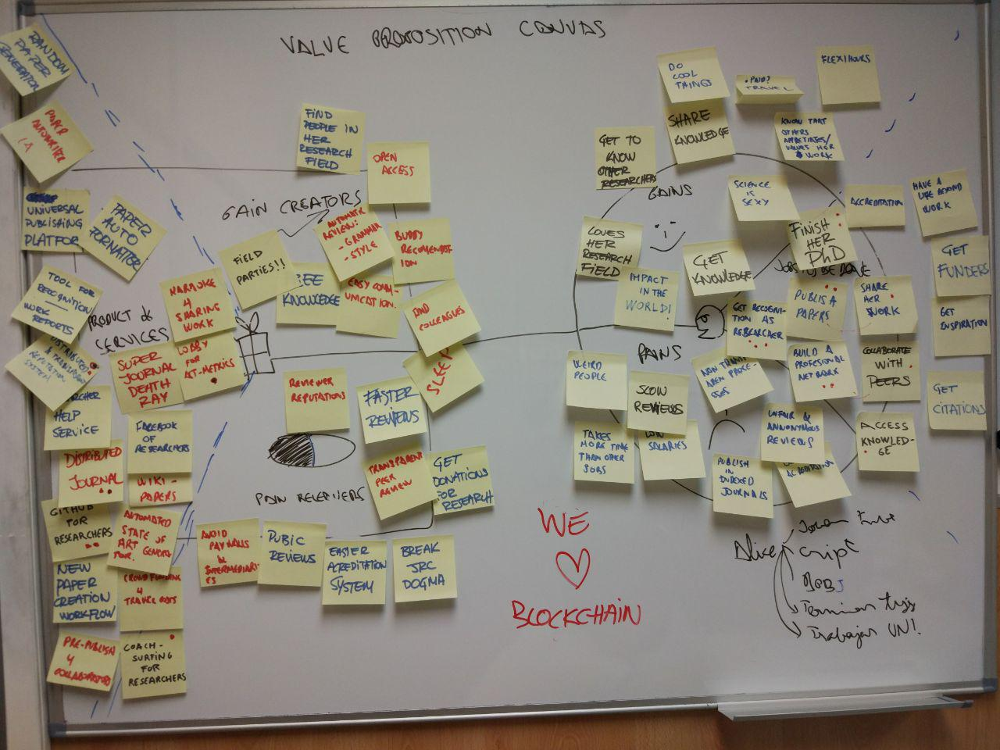
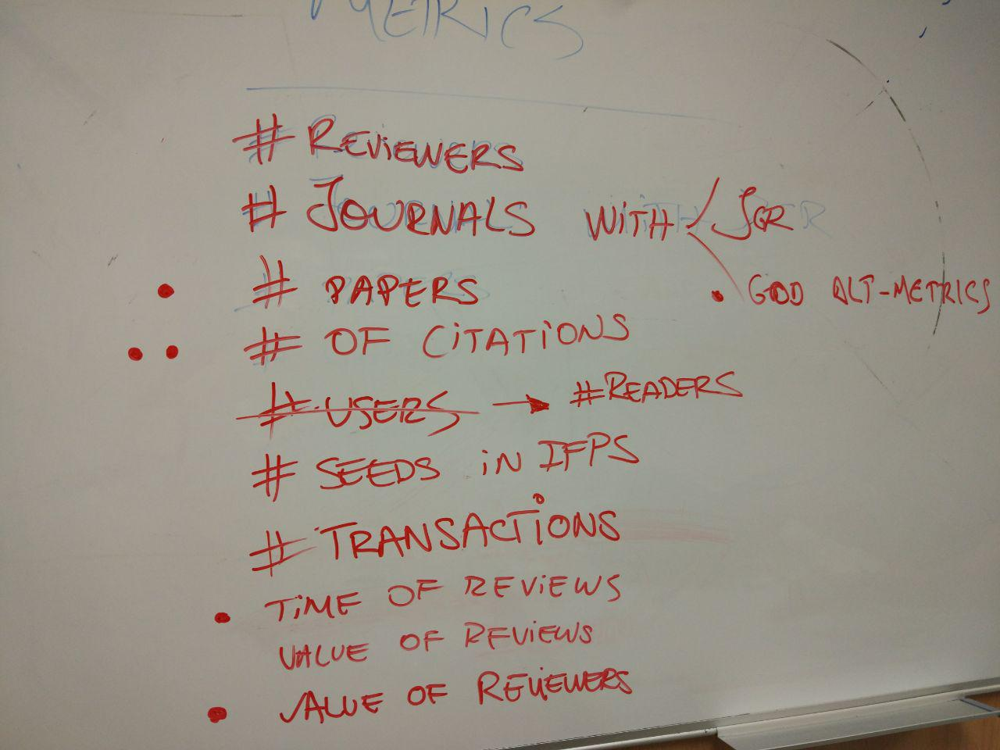

- [x] Who are your clients/users? (persona of your user)
- [x] What are their pain points?
- [x] What is your product's value proposition?
- [x] What is your distribution and go-to-market strategy? Who can you partner with?
- [x] What are the risks associated with your solution?
- [x] What is the impact of your solution? How will it be measured?
- [x] Define the technical specifications and development roadmap
- [x] Define your impact criteria and how you measure it

## Who are your clients/users? (persona of your user)

The main user of our product is represented by Alice, a young researcher that needs to finish her PhD and get recognition for her work. She is a crpytographer that needs to send papers in recognized journals such as Bob (Big Overpriced Boring journal). She likes to work in science, a sexy profession where she can do cool things and impact the world. However, sometimes the work is time consuming and unfair reviews can make the already slow peer review process even harder.

- The whole **scientific comunity**, interested in the open access and difussion of science.
- Citizens (Open Access to knowledge) including disenpowered communities that cannot currently afford the access to scientific knowdledge
- Institutions: cheaper access to Journals
- Innovation actors such as startups, research and development organizations, etc. Having a cheap and quick access to new knowledge

## What are their pain points?
- Accreditation through publishing in Indexed Journals
- Time to publish
- no transparent processes
- Low salaries
- non transparent processes
- Unfair anonymous reviews
- Time consuming

## What is your product's value proposition?

We aim to build a new distributed journals generation that will enable transparent processes for science publishing and remove unnecesary intermediaries and costs. This journals ecosystem will rely in a decentralize network of reviewers, that will gain reputation in their field as they provide good peer reviews. Thus, we aim to encourage better and faster reviews through a reviewer reputation ystem, that will improve publishing experience for authors and journals and will enable more transparent processes. Journals will be able to govern themselfs with Smart Contracts, making their processes even more transparent an becoming Distributed and Autonomous. Papers will be openly shared and published in the IPFS p2p technology. By removing intermediaries, we aim to provide a method for publishing open science that is free for authors and free to access.

## What is your distribution and go-to-market strategy? Who can you partner with?

There are several Open Access journals that could benefit with our technology, making the publishing process easier for authors, reviewers and editors while reducing costs and pains. We aim to serve these journals first by providing a network of reputable and fast reviewers, and after by helping them publish through P2P technology and to establish their processes as transparent Smart Contracts.

Other potential partners are:

- Academic institututions such as universities.
- Researchers
- Research groups
- New Open Access Journals

## What are the risks associated with your solution?
- Monpolistic strategies against our journals (JCR, the defacto standard, is produced by a Status Quo company affected by the project)
- Risk aversion of researchers, that will not send papers unless impact is likelly
- Big inertia of Academia and Academic Publihing, that could not be ready for big changes

## What is the impact of your solution? How will it be measured?
- Provide a new supply chain for science ditribution that removes intermediaries and improve efficiency while enabling innovation in the research publication processes and workflows.
- Increase the number of Open Access Journals
- Break the vampirist chain of publishers who benefit with other people's work.

## Define the technical specifications and development roadmap
Proof of concept:
  - Develop a sample contract in Ethereum with a journal gobernance models
    - Test the contract
    - Review the contract rules
    - Review contract security
  - Develop an infrastructure for submiting, reviewing and publishing papers in IPFS:
    - Best data structure for papers and reviews
    - Distribution and access strategies from current web technologies.
    - Provide cryptographic solutions for double blinded peer review and other processes we aim to support.
    - Provide DOIs or other identifiers for published papers

First descentralized journal, the Distributed Open Journal of Distributed Open Technologies (DOJôDOT):
  - DOJôDOT first call for papers
    - Create and deploy the Journal's governance contract in Ethereum
    - Develop an initial network of reviewers
    - Publish a sample paper to IFPS
    - Accept the published sample paper through Journals governance (maybe in the form of an editorial)

## Define your impact criteria and how you measure it

Being our goal to help researchers to publish their work in transparent peer reviewed journals with good metrics (both standard such as JCR or Alternative Metrics), our most relevant impact metrics are defined as follows:

*Author satisfaction*: new author to recurrent author convertion ratio
*Journal satisfaction*: new journal to recurrent journal convertion ratio
*Peer-review quality*: average review rating / average time of review
*Recognized Impact*: number of published papers * (number of citations - number of unrecognized citations / number of citations)

from which we derive our **KEY METRIC**: number of authors * author satisfaction

We understand our *key metric* as dependant to other metrics, as the number of satisfied authors depends on how many recognized journals are in the system and how our system improves peer review process.

Following we list the factors identified as relevant to our product.

- \# of decentralized journals
- \# of decentralized journals with JCR
- \# of decentralized journals with good Alt-Metrics
- \# of authors
- \# of submissions
- \# of published papers
- \# of reviewers
- \# of citations
- \# of peers sharing papers (seeds)
- \# impact factor of journals
- \# time of response of journals
- perceived quality of Journal vs traditional Journals  (Through formulaires)
- Value of reviews (through reviewers rating system)

